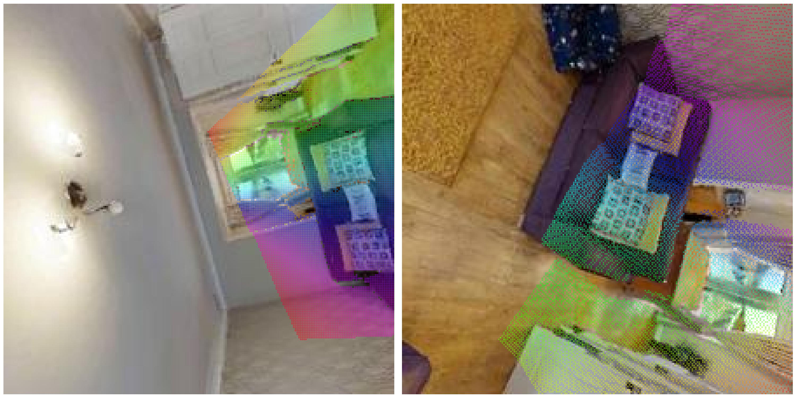
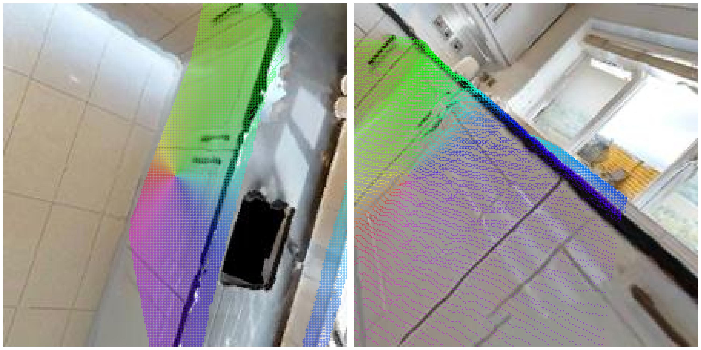

# 3D Vision Challenge

Implementation for finding pixel correspondences between rectified RGB-D image pairs using geometric computer vision techniques.

## Problem Statement

Given a pair of rectified RGB images with corresponding depth maps and camera parameters (intrinsics and extrinsics), determine:
1. For each pixel in Image A, whether it is visible in Image B, accounting for:
   - Camera frustum boundaries
   - Occlusion handling via depth comparison
2. For visible pixels, compute their precise corresponding coordinates in Image B

### Input Data
- RGB Images 
- Depth Maps (image, with metric conversion metadata)
- Camera Parameters:
  - Intrinsics: Horizontal field of view (degrees)
  - Extrinsics: Position (x,y,z) and orientation (quaternion x,y,z,w)
Data is in right-handed coordinate system (X-right, Y-up, Z-into-scene)

---

## Solution Overview

The solution consists of the following high-level steps:

Given a pair of images A and B, 
1. **Depth to 3D (Camera A)**: Convert every pixel in Image A into a 3D point using camera intrinsics.
2. **Transform to World**: Use extrinsics to convert 3D points from camera coordinates to world coordinates.
3. **Transform to Camera B**: Apply the inverse of Camera B's extrinsics to convert the 3D points into Camera B's frame.
4. **Project to 2D (Image B)**: Use Camera B's intrinsics to project the 3D points onto its image plane.
5. **Visibility & Occlusion Check**:
   - Ensure projections fall within the bounds of Image B.
   - Compare reprojected depth against Image B's depth map to reject occluded points.
6. **Visualization**: Color-code correspondences based on Image A's pixel polar angle and plot on both views.

---

## Results

This implementation achieves:
- Clear correspondence maps

- Proper occlusion handling

- Real-time capable processing
Part-vectorised implementation: ~1.2s for whole sample dataset
Fully vectorised implementation: ~0.04s for whole sample dataset

## Usage

Setup:
```bash
conda create -n vision3d python=3.10
conda activate vision3d
pip install -r requirements.txt
conda install -c conda-forge open3d
```

Run:
```bash
python solution.py
```

- Use `--visualize` to visualize intermediate steps like images, depth maps, and 3D point clouds.
- Use `--vectorised` to use the fastervectorised implementation.

To run tests:
```bash
python test.py
python test_vectorised.py
```


## Tools & Libraries Used
- `numpy`, `torch`: Vectorized operations
- `matplotlib`, `pandas`: Visualization
- `open3d`: Visualize 3D point clouds and camera frames
- `roma`: Convert coordinates between different coordinate systems
- `Pillow`: Load RGB and depth images

---

## Limitations
- **Single-pair logic**: The code processes image pairs sequentially. It could be extended to batch inference with PyTorch if camera intrinsics and image dimensions were consistent.
- **Depth noise sensitivity**: Occlusion checking relies on depth thresholds and may miss fine occlusion edges. A multi-pass Z-buffer approach could be more robust.
- **FOV assumption**: The intrinsics are computed assuming symmetric FOV and square pixels. This works here but would not generalize to skewed intrinsics or asymmetric sensors.
- **No error metrics**: Currently, the code produces visual validation but no quantitative re-projection error or coverage metrics.

